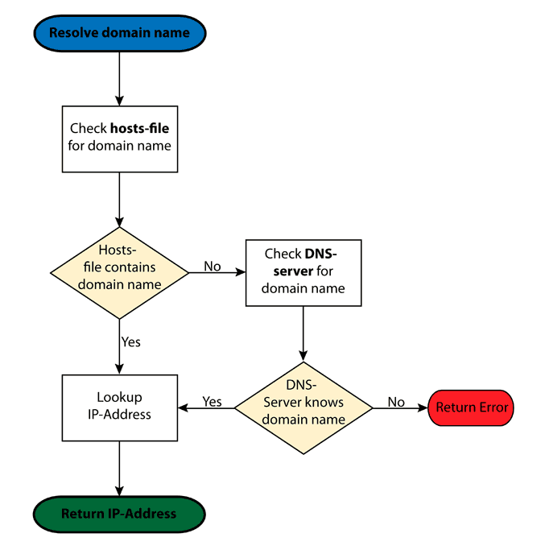
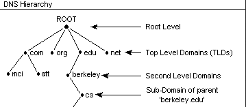
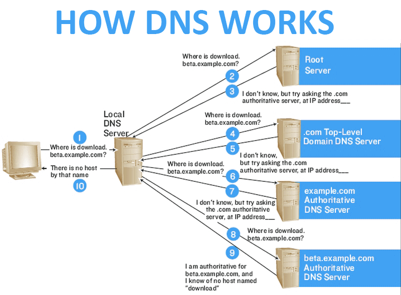

# DNS

Pc1 -> polipol.de

1 - C:\Windows\System32\drivers\etc\hosts
2 – AD- Local (Router) 
3 – DNS Public -ISP

#get cache local
Get-DnsClientCache

ipconfig /displaydns

#del cache
Clear-DnsClientCache 

ipconfig /flushdns

# Resolve DNS
Resolve-DnsName google.com 
nslookup google.com

# PS DNS
Get-Command *dns* | ft -auto

## FlowChart DNS

## DNS

